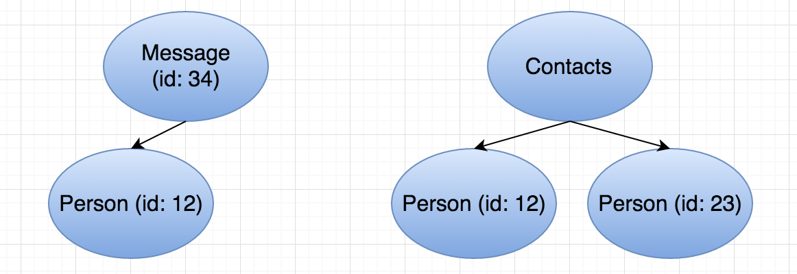
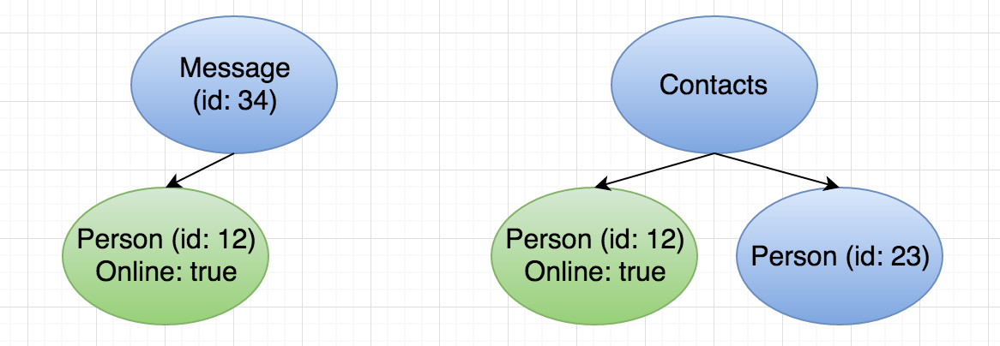

Rocket Data
===========

Rocket Data provides a simple, synchronous API to manage immutable models. Each user of the library owns a data provider which wraps the immutable model. You can set and edit data providers synchronously. Under the hood, any changes are asynchronously propagated to other data providers and the cache. This allows your application logic to be simple and your model management to never block the main thread or slow down your app.

A Simple Example
----------------

For this example, the application uses a message model and a person model. These models can be represented as trees, as shown below. For more details on how these models are implemented, see :doc:`050_models`.

The application has two view controllers. One shows a message from a person. The other shows a list of contacts. Note: some setup is needed for the code below to compile. See :doc:`040_setup`.

.. code-block:: c

  class MessageViewController: UIViewController, DataProviderDelegate {

    let dataProvider = DataProvider<Message>()

    override func viewDidLoad() {
      super.viewDidLoad()

      dataProvider.fetchDataFromCache(cacheKey: self.id) { (model, error) in
        self.refreshView()
      }

      NetworkManager.fetchMessageWithId(self.id) { (message: Message?) in
        self.dataProvider.setData(message)
        self.refreshView()
      }
    }

    func refreshView() {
      // Access your data through the data provider
      title = dataProvider.data?.title
      // Other things to layout your view
    }

    func dataProviderHasUpdatedData<T>(dataProvider: DataProvider<T>, context: Any?) {
      refreshView()
    }
  }

  class ContactsViewController: UIViewController, CollectionDataProviderDelegate {

    let dataProvider = CollectionDataProvider<Person>()

    override func viewDidLoad() {
      super.viewDidLoad()

      dataProvider.fetchDataFromCache(cacheKey: "contacts") { (models, error) in
        self.tableView.reloadData()
      }

      NetworkManager.fetchContacts() { (contacts: [Person]?) in
        if let contacts = contacts {
          self.dataProvider.setData(contacts, cacheKey: "contacts")
        }
        self.tableView.reloadData()
      }
    }

    func collectionDataProviderHasUpdatedData<T>(dataProvider: CollectionDataProvider<T>, collectionChanges: CollectionChange, context: Any?) {
      self.tableView.reloadData()
    }
  }

Data Flow
---------

=========================
Fetching from the Network
=========================

  1. The MessageViewController fetches data from the cache and network simultaneously.
  2. When the data comes back from the cache, the MessageViewController refreshes with this data. If the network data comes back before the cache, then the data provider will ignore the cached data.
  3. When the fresh data comes back from the network, the MessageViewController again refreshes.
  4. This network data will be asynchronously propagated to the cache.
  5. The MessageViewController now has a reference to a Message (id: 34) which has a reference to a Person. Let's say the online property of this Person (id: 12) is false.
  6. Later, the ContactsViewController fetches data from the network and cache following the same steps as above. In the contacts list, there is a Person (id: 12) with online property true.
  7. When we call `setData` with this new list of Person models, Rocket Data detects that the MessageViewController needs to be updated. It will update the DataProvider there and call the delegate method in MessageViewController. MessageViewController now simply refreshes its UI and will render that the Person is online. This consistency management happens automatically for all models used in DataProviders.

At the end of these actions, our data now looks like this:

==============
A Local Change
==============

  1. Later in the application, the user creates a new contact. The application now has a new Person object to add to the list of contacts, but is in a different view controller.
  2. The application can easily add this to the list of contacts with a class method:

  .. code-block:: c

    CollectionDataProvider<Person>.append([newPerson], cacheKey: "contacts", dataModelManager: DataModelManager.sharedInstance)

  If the ContactsViewController is in memory, this will get appended to the collection and the delegate method will be called. The ContactsViewController can then rerender. The CollectionChanges object will specify that a row has been added at a certain index if you would prefer to only rerender part of the view.
  3. If any data provider has a reference to a Person with the same id as newPerson, it will automatically update and notify its delegate.
  4. Later, the ContactsViewController may want to update, remove, or insert a new contact. This is trivial as all these APIs are available on the CollectionDataProvider. Anyone listening to these models will automatically be updated with the new versions.
