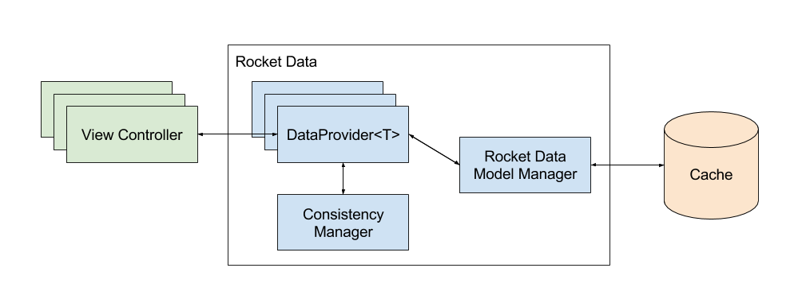

Architecture
============

This diagram shows a high level of Rocket Data.

	1. View Controller. Application code which mainly talks to ``DataProviders``.
	2. ``DataProvider<T>``. The main API which view controllers interact with. See :doc:`030_dataProviders`
	3. ``ConsistencyManager``. The consistency engine which drives Rocket Data. See https://linkedin.github.io/ConsistencyManager-iOS/.
	4. Rocket Data Model Manager. A light-weight class which coordinates between ``DataProviders`` and the cache.
	5. Cache. The cache implemented by the application. See :doc:`060_cacheDelegate`.

For a more detailed walk-through of this diagram, see our Realm talk:

https://realm.io/news/slug-peter-livesey-managing-consistency-immutable-models/
